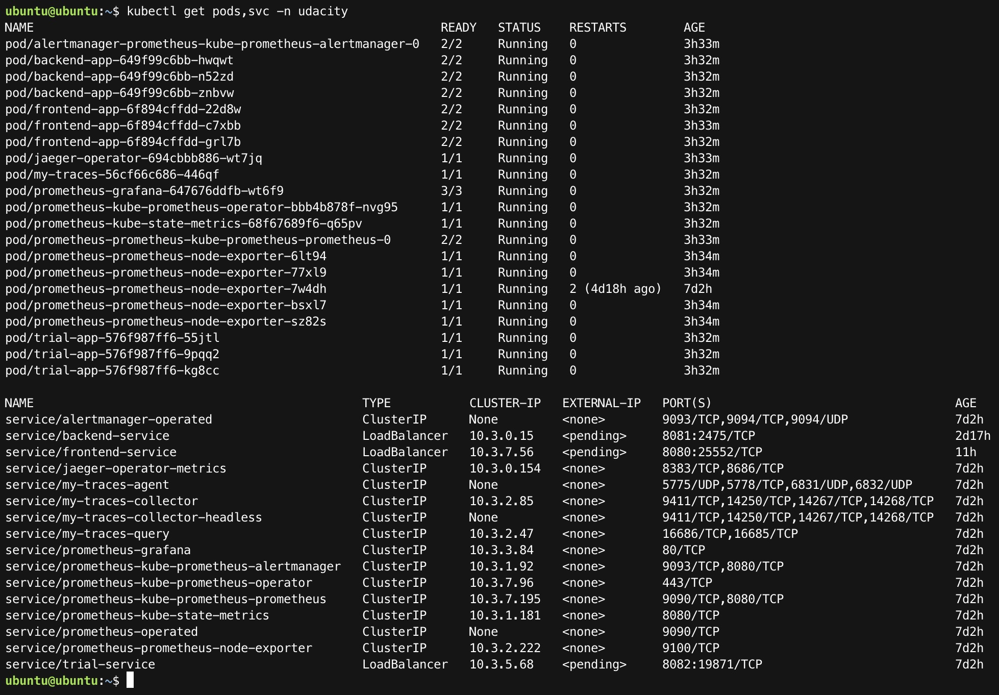
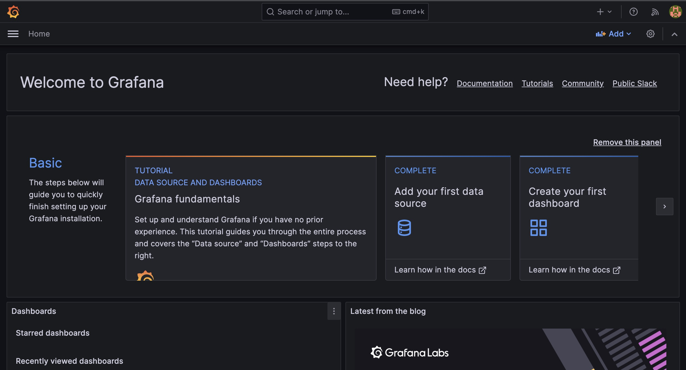
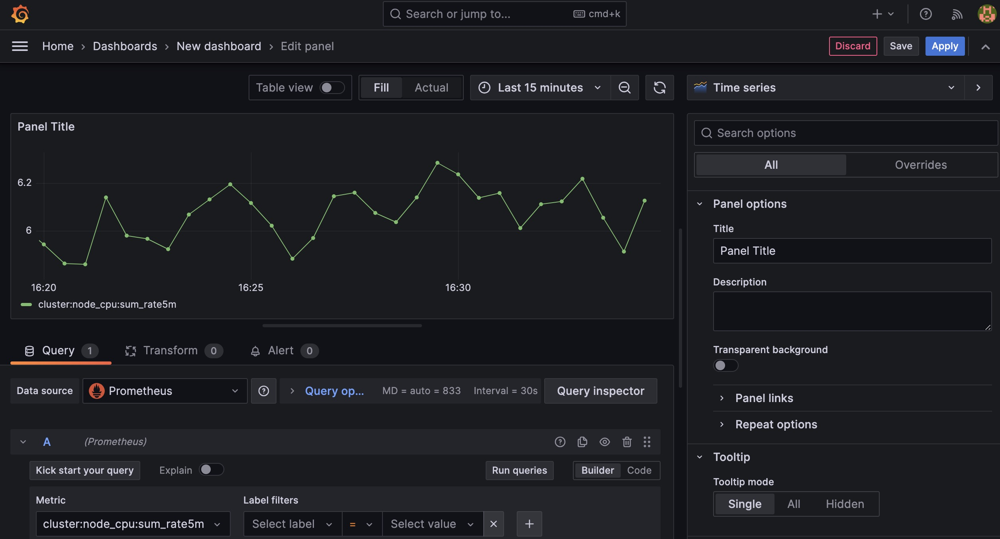
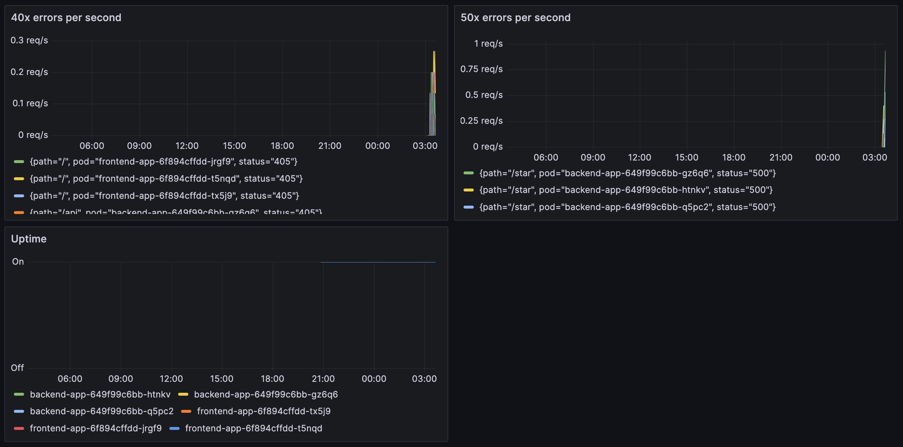
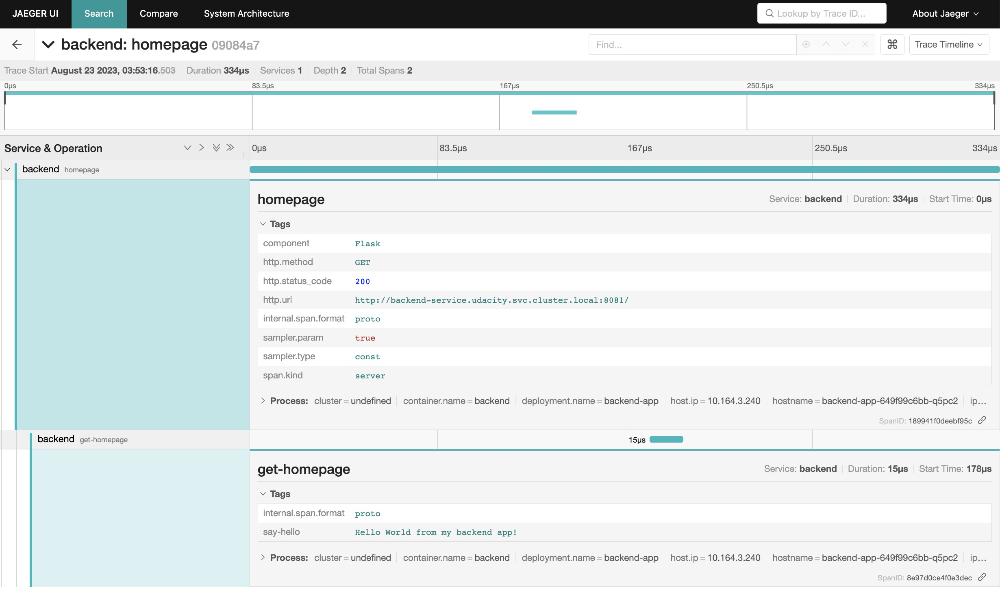
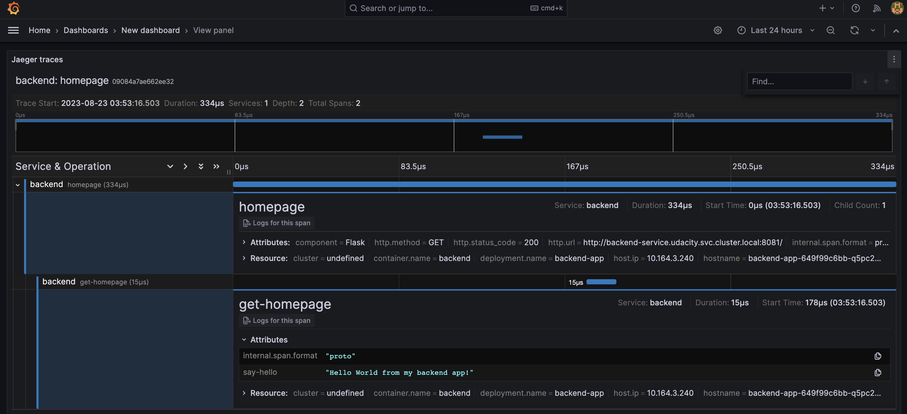
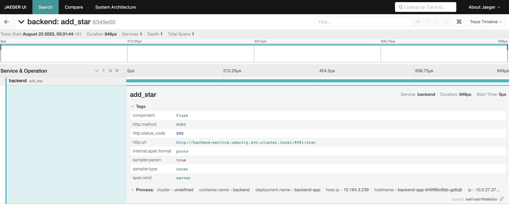
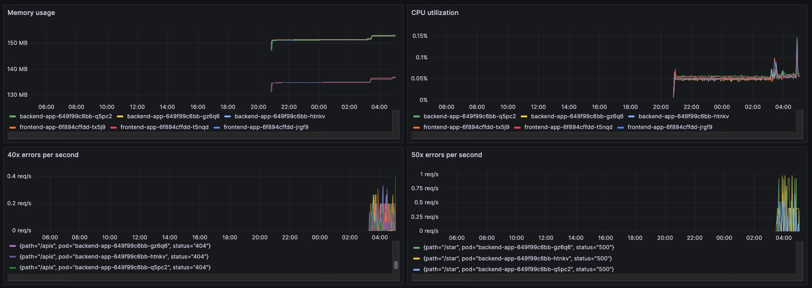
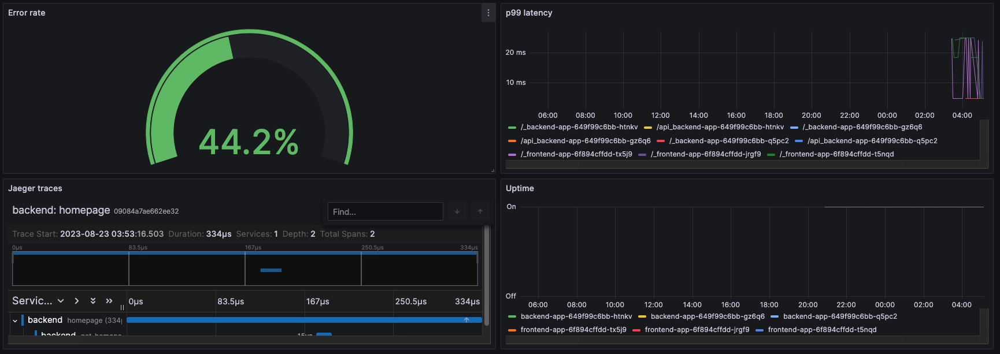

**Note:** For the screenshots, you can store all of your answer images in the `answer-img` directory.

## Verify the monitoring installation

*TODO:* run `kubectl` command to show the running pods and services for all components. Take a screenshot of the output and include it here to verify the installation

## Setup the Jaeger and Prometheus source
*TODO:* Expose Grafana to the internet and then setup Prometheus as a data source. Provide a screenshot of the home page after logging into Grafana.

## Create a Basic Dashboard
*TODO:* Create a dashboard in Grafana that shows Prometheus as a source. Take a screenshot and include it here.

## Describe SLO/SLI
*TODO:* Describe, in your own words, what the SLIs are, based on an SLO of *monthly uptime* and *request response time*.

*monthly uptime*
1. Uptime of pods - If uptime measurement is time-based
2. Error rates (20x, 40x and 50x responses per second) - If uptime is measured based on the percentage of successful requests.
3. Saturation - To check service load - if beyond permissible limits, the service may go down or become slow.
*request response time*
1. Average response time - To measure the average time taken to serve a request.
2. Requests per second - To measure service load.

## Creating SLI metrics.
*TODO:* It is important to know why we want to measure certain metrics for our customer. Describe in detail 5 metrics to measure these SLIs.

At a minimum, it's important to measure the following metrics because they offer a wide view of a service from a customer's/user's perspective:
1. Error rate
It's the rate of failures in the application/system, e.g.,
a) rate of 40x and 50x errors per second - indicates the rate of unsuccessful requests
b) kubelet_runtime_operations_errors_total - indicates low level issues in the node, like problems with container runtime
2. Saturation
It measures the consumption of system resources such as cpu utilization, memory usage, disk space, network bandwidth, etc.
3. Traffic
It's the measure of service demand among users. For an web application, it's generally the number of requests per second.
4. Latency
It's the time taken to service a request.
5. Uptime
It's the percentage of time a system is ready for operation.

## Create a Dashboard to measure our SLIs
*TODO:* Create a dashboard to measure the uptime of the frontend and backend services We will also want to measure to measure 40x and 50x errors. Create a dashboard that show these values over a 24 hour period and take a screenshot.

## Tracing our Flask App
*TODO:*  We will create a Jaeger span to measure the processes on the backend. Once you fill in the span, provide a screenshot of it here. Also provide a (screenshot) sample Python file containing a trace and span code used to perform Jaeger traces on the backend service.

## Jaeger in Dashboards
*TODO:* Now that the trace is running, let's add the metric to our current Grafana dashboard. Once this is completed, provide a screenshot of it here.

## Report Error
*TODO:* Using the template below, write a trouble ticket for the developers, to explain the errors that you are seeing (400, 500, latency) and to let them know the file that is causing the issue also include a screenshot of the tracer span to demonstrate how we can user a tracer to locate errors easily.

TROUBLE TICKET

Name: backend app errors

Date: 23 August 2023

Subject: 500 errors were seen for the backend app

Affected Area: The handler for the /star endpoint

Severity: Major

Description: Failures were observed for several POST requests to the /star endpoint. Looks like the server received invalid inputs which it couldn't handle. 

## Creating SLIs and SLOs
*TODO:* We want to create an SLO guaranteeing that our application has a 99.95% uptime per month. Name four SLIs that you would use to measure the success of this SLO.
1. The percentage of time the service has been up
2. The percentage of successful requests
3. p99 latency
4. CPU utilization

## Building KPIs for our plan
*TODO*: Now that we have our SLIs and SLOs, create a list of 2-3 KPIs to accurately measure these metrics as well as a description of why those KPIs were chosen. We will make a dashboard for this, but first write them down here.
I would choose the following metrics as they correspond directly with user experience and business impact:
1. Uptime - Indicates the overall reliability and stability of the system
2. Latency - Has a direct bearing on user-experience. 
3. Error rate - Indicates issues with the system

## Final Dashboard
*TODO*: Create a Dashboard containing graphs that capture all the metrics of your KPIs and adequately representing your SLIs and SLOs. Include a screenshot of the dashboard here, and write a text description of what graphs are represented in the dashboard.

The dashboard has the following panels:  
1. Memory Usage - The memory used by the app containers (shown for every pod)
2. CPU Utilization - The cpu utilization of app containers (measured over intervals of 5 minutes and shown for every pod)
3. 40x errors per second - The number of 404 and 405 errors per second (measured over intervals of 30 seconds)
4. 50x errors per second - The number of 500 errors per second (measured over intervals of 30 seconds)
5. Error rate - The percentage of erroneously processed requests within the 30 seconds
6. p99 latency - The 99th percentile of request durations over the last 30 seconds
7. Jaeger traces - Jaeger traces for frontend and backend apps
8. Uptime - Uptime for frontend and backend pods

